功能效果图

#### 1、可视化时钟界面

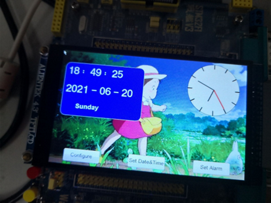

如图所示，展示了当前时间的十进制表示，以及当前是周几。

旁边的表盘实时显示时钟。

#### 2.**通过屏幕设置时钟时间功能.**

①点击屏幕上Set Date&Time按钮

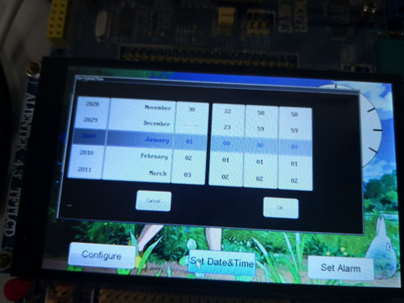

将会出现如上所述的画面。

选择时间2012-03-03 03：06:31，点击OK按钮，将会出现如下界面：

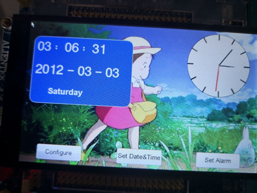

#### 3、通过屏幕设置闹钟时间功能

点击屏幕Set Alarm按钮，将会出现以下界面：

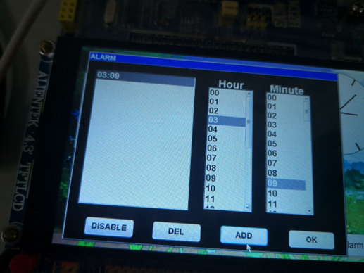

选择闹钟的时间，进行ADD操作，ADD之后，点击OK按键即为设置成功！

通过串口通信，将设置闹钟时间的情况显示到XCOM软件中。验证设置闹钟时间成功。

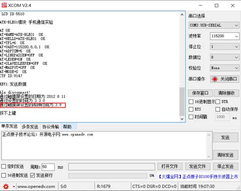

#### 4、通过屏幕设置时钟时区时间功能.

当前时间界面：

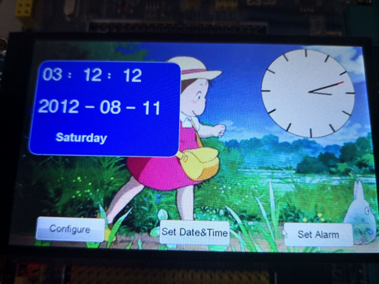

点击Configure按钮，出现如下窗口：

选择“London”表示设置London时间，结果如下图：

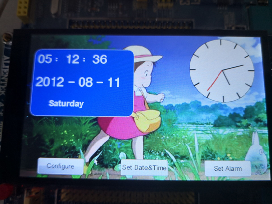

重置了当前时区的时间。

#### 5、通过蓝牙设置时钟时区时间功能

打开手机蓝牙串口调试助手，连接BLE-01蓝牙，与STM32开发板相连

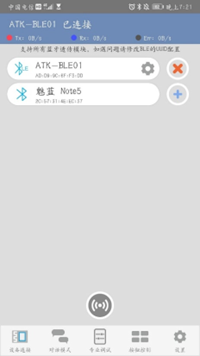

以T开头发送时间：

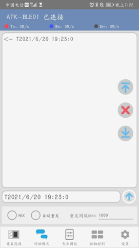

之前的时间为：

蓝牙设置时间后为：

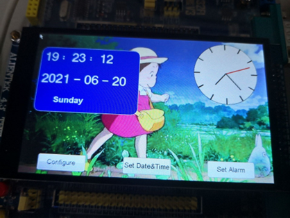

通过蓝牙发送时间成功

#### 6、通过蓝牙设置闹钟时间功能.

以A开头设置闹钟的时间：

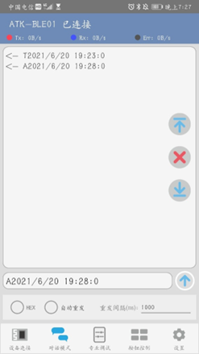

通过XCOM可以看出设置闹钟时间成功！

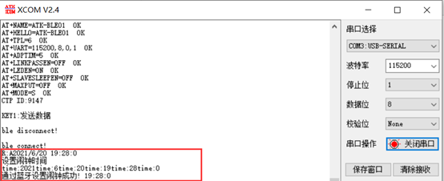

#### 7、通过蓝牙关闭闹钟时间功能

使用手机蓝牙助手，发送”close”,即可关闭闹钟的蜂鸣器。

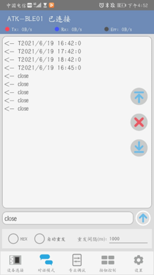

XCOM上可以看到，通过蓝牙关闭闹钟成功字样。

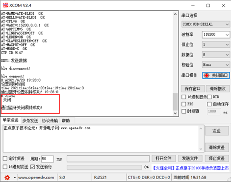